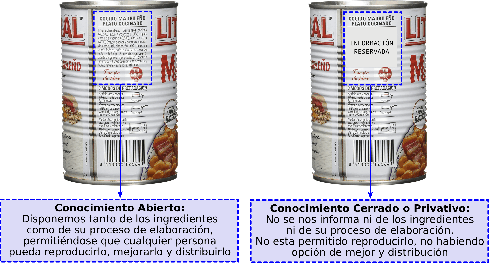

# Conocimiento Libre

Podríamos copiar aquí la [definición de **Conocimiento Libre** de la wikipedia](https://es.wikipedia.org/wiki/Conocimiento_libre), pero consideramos que no es necesario para llegar a comprender su importancia y bondades. Creemos que es mejor presentar ejemplos prácticos para su mejor comprensión. Además, con todo ello **Conocimiento Libre** busca el beneficio colectivo y un mundo de oportunidades igualitario para todos.

La mejor forma de comprender que es el conocimiento libre y sus beneficios es compararlo con el conocimiento cerrado o privativo. Para ello, a modo de ejemplo, se muestran dos productos aparentemente iguales pero que difieren en la información que aportan: **abierta** y **cerrada**.

**¿Cúal de los dos productos preferirías comprar? ¿Elegirías un producto sin saber los ingredientes que lo componen y procedimiento que se ha seguido para su elaboración?** En el mundo de software ocurre algo similar, hay productos software cuyos desarrolladores/creadores proporcionan una completa información de como ha sido construido el software y otros que no.  Paradójicamente, el software cerrado está mucho más extendido que el software abierto en los equipos informáticos de sobremesa y portátiles, propiciado por una potente maraña de intereses económicos, financieros y monetarios por parte de unas pocas compañías informáticas con hegemonía mundial que están interesadas en que ese panorama siga durante mucho tiempo así.
El conocimiento libre permite que cualquiera tenga el conocimiento suficiente para poder reproducir y distribuir cualquier tipo de producto que sea libre, garantizando que los beneficios sean más contenidos y repartidos, impidiendo que sean sólo unas pocas las compañías que tengan su hegemonía.  Esta claro que eso no interesa a aquellas empresas que ansien acaparar muchísimos beneficios.

Siguiendo con el símil anterior, y tratando de comprender el término **Conocimiento Libre**, ¿Qué sería una **Cocina libre o Cocina Abierta**? Una **cocina abierta** sería aquella donde tanto los ingredientes como el proceso de creación son de acceso público para que todo aquel que quiera **reproducirlo con exactitud** pueda hacerlo, dando libertad a poder modificar la lista de ingredientes o pasos a seguir en el proceso de creación, en el caso de considerar que puede mejorarse, y distribuir la nueva receta para que otros puedan disfrutar del nuevo plato confeccionado.  Por contra, una cocina cerrada sería aquella donde ni la lista de ingredientes, ni el proceso a seguir puede hacerse pública, y por tanto, no esta permitida su distribución (***sería necesario adquirir una licencia para ello***) imposibilitando que públicamente pueda disfrutarse de ello, a menos que se pague.
