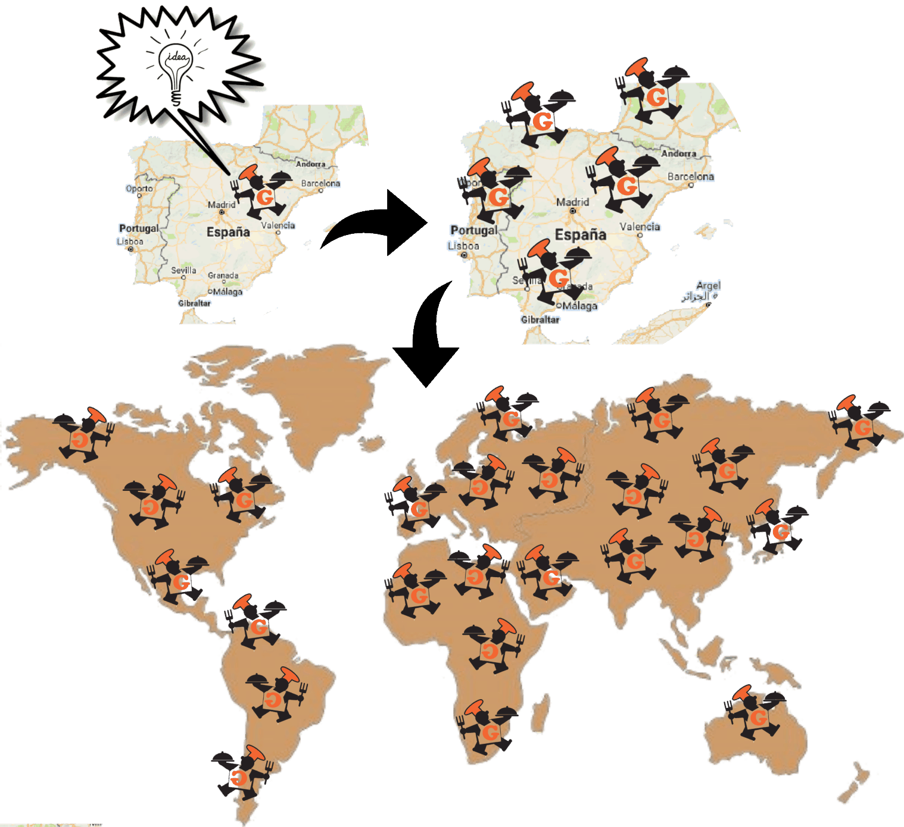

## Ejemplo de Conocimiento Libre: Cocina Libre

Supongamos que un cocinero Zaragozano crea un riquísimo y delicioso plato, con un éxito enorme entre la población y con una gran demanda de reservas en su restaurante para poder probarlo, decide ceder en formato libre la información de sus ingredientes y proceso de creación. ¿Qué beneficios colectivos aportaría?

- Permite que cualquier persona pudiera reproducir el plato en su casa y degustarlo sin necesidad de ir a ese restaurante.  Este beneficiará sobre todo a aquellas personas que vivan en localidades no cercanas a la del restaurante.
- Permite que otros cocineros emprendedores de otras ciudades, a nivel nacional o mundial, puedan hacer uso de esa receta y tener el mismo éxito en sus restaurantes que está teniendo él.
- Permite que cualquier persona pueda modificar la receta y adaptar su elaboración a las necesidades de otros grupos de usuarios (***celiacos, vegetarianos, veganos, etc.***), ampliando de esta forma el grupo de usuarios que se benefician de ello.
- Permite por tanto mejorar y distribuir las mejoras en la receta para que la comunidad global se beneficie de ello: clientes para su degustación y restaurantes para obtener beneficios de ello.
- En definitiva, evita monopolizar los beneficios y garantiza el reparto y distribución de sus beneficios.

