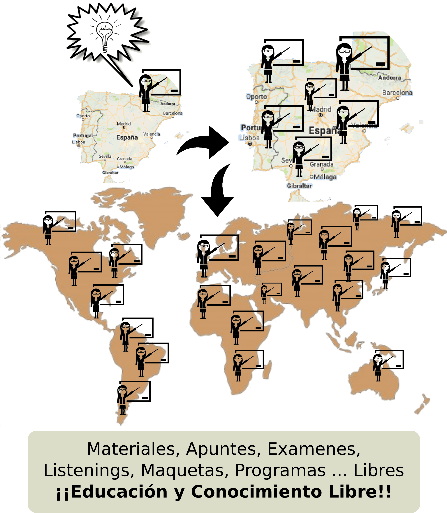

## ¿Qué otras áreas deberían ser de Conocimiento Libre?

Si se ha comprendido el ejemplo mostrado en relación a la **Cocina Libre**, ¿Qué otras áreas consideras que mejorarían el contexto mundial en beneficio de todos los individuos si fueran libres? Seguro que se te ocurren muchas, y entre esas podríamos destacar las siguientes:

- **Educación**.  ¿Crees que la educación sería mejor si todos los materiales educativos disponibles fueran libres? Materiales, apuntes, exámenes, listenings, ebooks, maquetas, programas, programaciones, manualidades, experimentos, ... fueran libres. Materiales que estuvieran disponibles para poder mejorarlos, adaptarlos y volverlos a distribuir para que otros pudieran beneficiarse de ello.

- **Farmacia**. Si los fármacos, su composición y elaboración, fueran libres ... ¿No crees que se erradicarían las enfermedades de una forma más eficiente?  El mundo farmaceútico es el claro ejemplo donde los intereses monetarios y el ansia de poder están muy por encima del bien común.

- **Software**. En una era tecnológica como la actual donde existen aplicaciones para prácticamente todo lo que se pueda uno imaginar, el software libre cobra una importancia fundamental.  La posibilidad de poder compartir de manera abierta el código de un programa permite su aprovechamiento para llevar a cabo mejoras e idear nuevas aplicaciones que puedan resultar útiles. Prácticamente el 100% de los proyectos de software actuales hacen uso de código libre para acelerar su creación y crear comunidad de usuarios. Sin esta posibilidad la mayoría de los programas y aplicaciones que actualmente conocemos no existirían y los avances serían mucho menores.
