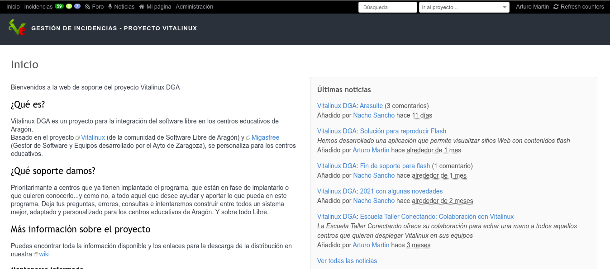

# Web de Soporte

Con la finalidad de dar soporte técnico a todos los centros educativos de la Comunidad Autónoma de Aragón que hacen uso de **Vitalinux** existe una web donde previo registro un usuario puede solicitar ayuda y asesoramiento sobre cualquier aspecto concerniente a **Vitalinux**: [Web de soporte](https://soporte.vitalinux.educa.aragon.es/)

Los usuarios que actualmente están registrados en dicha Web de soporte suelen corresponderse con los coordinadores Vitalinux de los centros educativos, pero pueden registrarse todos aquellos usuarios interesados en Vitalinux y todo su ecosistema.  Estos coordinadores son las personas que han sido designadas en sus centros para encargarse de la gestión de los equipos Vitalinux, haciendo de intermediarios entre el centro educativo y los técnicos informáticos de Vitalinux.  A continuación se detallan los posibilidades que esta web de soporte le ofrece al coordinador Vitalinux o al usuario que esté registrado:

* **Abrir una nueva petición o incidencia**. Teniendo en cuenta que Vitalinux es un sistema que se gestiona de manera remota y desatendida mediante Migasfree, los coordiandores Vitalinux usan esta vía para solicitar cualquier cosa relacionada con Vitalinux: instalación/desinstalación de programas para los equipos de su centro, configuración de nuevas impresoras, personalización de su entorno de Escritorio, gestión de cuentas de usuario, etc.  Al ser un programa totalmente abierto, pueden consultarse públicamente todas estas peticiones, a excepción de aquellas que incluyan datos privados (*contraseñas, datos relevante de alumnos, etc.*): [Lista de peticiones de la Web de Soporte](https://soporte.vitalinux.educa.aragon.es/projects/vitallinux-dga-soporte/issues)


Cabría señalar que es posible añadir una nueva petición o incidencia de forma anónima, sin necesidad de registro previo, indicando como destinatario <b>soportevitalinux@educa.aragon.es</b>.


* **[Noticias](https://soporte.vitalinux.educa.aragon.es/projects/vitallinux-dga-soporte/news)**: Desde la Web de soporte se publican todas las noticias referentes al programa, que posteriormente son enlazadas en la [Wiki del prpoyecto](https://wiki.vitalinux.educa.aragon.es). Estas noticias pueden ser publicadas por los usuarios registrados, por lo que suelen corresponderse con noticias de perfil técnico o divulgativo.

* **[Foros](https://soporte.vitalinux.educa.aragon.es/projects/vitallinux-dga-soporte/boards)**: Los foros se corresponden con debates, discusiones, dudas o cualquier otro asunto relacionado con Vitalinux en los que se invita a participar a la comunidad de usuarios registrados.  Estos foros, al igual que las noticias, son de acceso público como puede comprobarse, pero únicamente pueden partipara usuarios registrados.