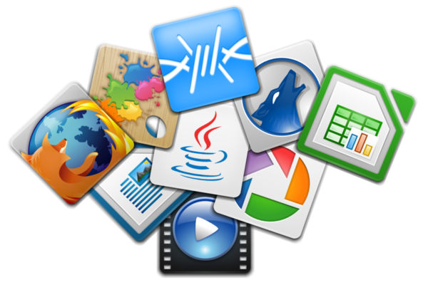

# Introducción

Dentro del ecosistema del Software en general, nos encontramos con la parte más visible del mismo: las aplicaciones. Las aplicaciones son los programas informáticos con los que interactuamos con el ordenador (o dispositivo), y son al fin y al cabo la esencia del uso o necesidad de las nuevas tecnologías.

Nos van a facilitar la realización de tareas complejas. A diferencia del sistema operativo, cuyo objetivo es gobernar el hardware y poner orden en la ejecución de los diferentes programas, las aplicaciones realizan funciones específicas. Gracias a ellas, podemos disponer de un centro ofimático, visualizar y editar imágenes, navegar por internet, hacer cálculos matemáticos complejos (o sencillos...). Existen aplicaciones sencillas o auténticas herramientas/suites complejas realizadas con miles o millones de líneas de código

Las aplicaciones no dejan de ser un programa escrito en un lenguaje de programación que realiza unas funcionalidades deseadas, pero podremos disponer de Apliacaciones Libres o Aplicaiones No Libres, Comerciales o No comerciales, de código abierto pero no libres (con una licencia restrictiva por ejemplo), gratuitas o de pago, y además compiladas (o disponibles) para ciertos sistemas operativos (y otros no) o incluso para solo algunas arquitecturas concretas (por ejemplo 64 bits)

En nuestro caso nos interesa profundizar en las aplicaciones libres. Las razones, tal como hemos hablado al principio son aplastantes en contraposición a las aplicaciones comerciales, y más en el ámbito de la educación:

* El código es **auditable**, garantía de que el código hace lo que tiene que hacer y no realiza acciones en segundo plano.
   Podemos modificar el código. Al tener disponible el código y poder modificarlo, podemos cambiar algo que no nos guste, personalizarlo e incluso involucrar a los alumnos en dicho proceso
* Podemos distribuir el software de forma **ética** entre nuestros alumnos. El alumno puede disponer de dicho software en casa sin necesidad de "piratear" o realizar alguna inversión.
* Como norma general, el software libre está **disponible** para todas las plataformas. Por tanto, no dependemos de usar un sistema operativo concreto para poder hacer uso del mismo. Qué ocurre si el alumno tiene en casa un Linux y en el centro un Windows? O al revés? O usa MacOs?
* La excusa de que es el software que se usa **en la empresa** solo puede llegar a ser justificable en etapas de Formación Profesional (e incluso en éste caso podría llega a ser discutible). El objetivo es que el alumno adquiera competencias tecnológicas, y las aplicaciones libres permiten dicha adquisición sin problemas
* *"Las aplicaciones propietarias funcionan mejor que las libres..."*. Es completamente discutible e incluso falso en muchas ocasiones. Tendemos a confundir desconocer una apliación con que **funcione** mal. Hay ejemplos de aplicaciones libres muy consolidadas y con un funcionamiento ejemplar.
   Libreoffice, Gimp o Firefox son suites y aplicaciones libres
   Incluso [la nave (Ingenuity) que llevó al Robot (Perseverance) a Marte](https://www.genbeta.com/linux/2021-ano-linux-marte-gracias-a-ser-sistema-operativo-helicoptero-que-acompana-al-rover-perseverance), estaba basado en Software Libre Open Source, y el código [se puede consultar y rehutilizar](https://github.com/nasa/fprime)

Terminamos ésta primera parte con una lectura sobre [porqué una institución educativa debería usar y enseñar software libre](https://www.gnu.org/education/edu-why.html "GNU Page") por el proyecto GNU:

1. Permite compartir conocimiento y herramientas
2. Responsabilidad Social ante el posible dominio de un desarrollador o multinacionales
3. Independencia del producto
4. Aprendizaje de la propia herramienta, la ética y la práctica profesional
5. Ahorro de costes que puede redundar en otras áreas con necesidad
6. Calidad

Veamos pues, qué aplicaciones y cómo tenerlas disponibles
