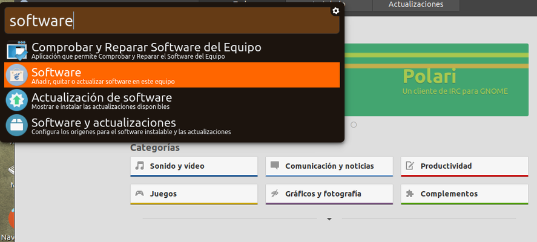
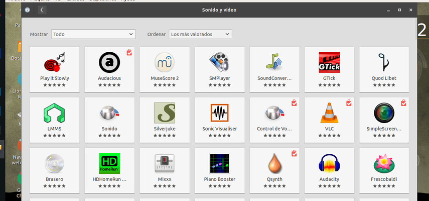
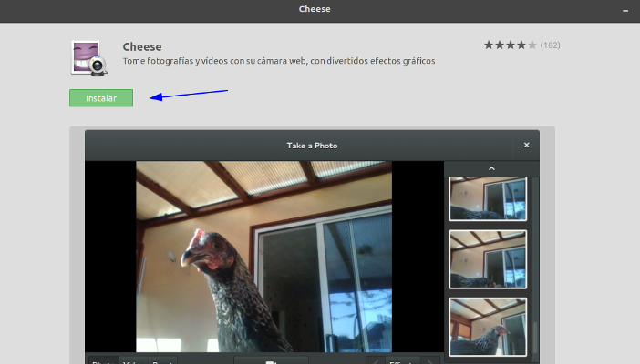
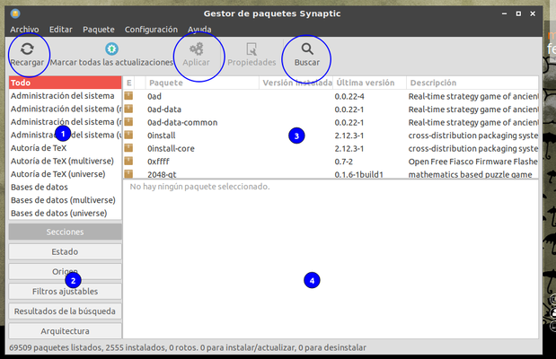
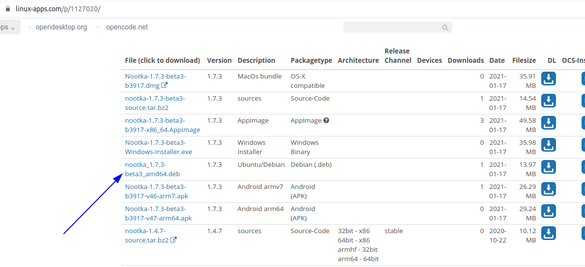
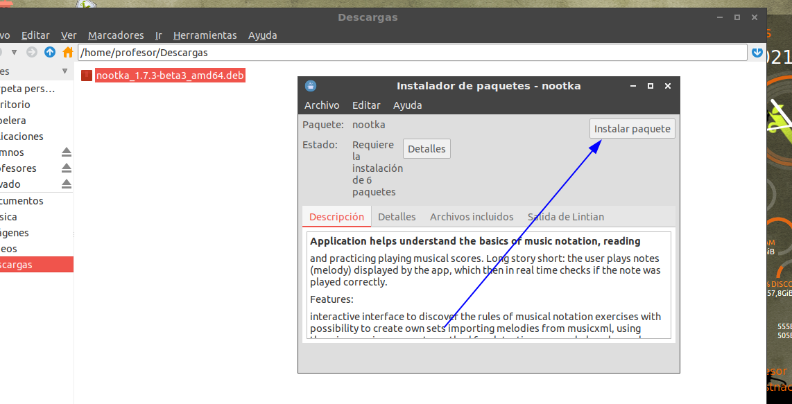

# Instalación de software y su código fuente

En éste apartado vamos a aprender a instalar software libre y hablaremos al final un poco sobre el código fuente.

## Instalación de Software 

Una vez que sabemos qué aplicación queremos usar/probar, vamos a instalarla. Para ello tendremos varios métodos

1. Centro de Software
2. Synaptic
3. Mediante migasfree
4. Manualmente mediante un paquete deb. Forma gráfica
5. Línea de comandos. Instalación de aplicaciones de un repo o directamente descagando el deb

### Centro de Software

**Vitalinux** es una distribución basada en la versión ligera de Ubuntu, la cual dispone de su propio '''Centro de Software''' que permite al usuario instalar y desinstalar aplicaciones de una forma muy gráfica y convencional, al estilo que estamos acostumbrados de un Store actual del móvil, pudiendo filtrar la búsqueda de una manera categorizada: '''Educación, Ofimática, Internet''', etc.

> Atención: es posible que NO encontremos todo el software disponible (por problemas de indexación)

Para interactuar con '''El Centro de Software''' simplemente debemos lanzarlo pulsando la combinación mágia **CONTROL + ESPACIO** y tecleando **Software**. Si no disponemos del lanzador, lo podremos encontrar en el menú o con el nombre de Centro de Software.



Podemos entonces seleccionar la categoría, aplicación e instalar o incluso lanzarla (si ya está instalada)




### Synaptic

Una de las aplicaciones más completa (gráfica) y usada en el mundo Linux para la gestión del software es **Synaptic**.  Aunque su aspecto visual no es tan amigable como el de otras aplicaciones equivalentes que han ido surgiendo con los años, su eficiencia y robustez han hecho que sea una aplicación muy asentada y universalmente utilizada en muchas distribuciones Linux.

Entre sus características cabría destacar:

* Permite **actualizar la lista de software disponible en los repositorios** configurados en la máquina
* Permite **buscar** rápidamente, **instalar y desinstalar** aplicaciones
* Permite solventar problemas con **paquetes rotos** (paquetes que no se terminaron de instalar correctamente)

Para interactuar con **Synaptic** simplemente debemos lanzarlo pulsando la combinación **"CONTROL + ESPACIO"**' y tecleando **"Synaptic ..."**':



La pantalla de Synaptic está dividida en 4 secciones. Las dos más importantes son la lista que incluye la sección de categorías (1) en el lado izquierdo y la de los paquetes (3) en el lado derecho. Al seleccionar un paquete de la lista se mostrará una descripción del mismo (4).

Para **instalar** un paquete seleccionaremos una categoría, pulsaremos con el botón derecho del ratón sobre el paquete deseado y seleccionaremos **Marcar para instalar o bien haremos doble clic** en el nombre del paquete. Marcaremos de esta forma todos los paquetes que deseesemos instalar en el sistema y pulsaremos sobre el botón **Aplicar** para que comience su instalación. Synaptic descargará él solo los paquetes necesarios desde los repositorios

También es posible emplear el botón **Buscar** para encontrar los paquetes que deseemos instalar. Al pulsar sobre este botón podremos realizar búsquedas de programas mediante su nombre o descripción. Una vez localizado el programa que deseamos instalar hacemos doble clic sobre él para instalarlo. Si queremos eliminar un programa bastará con que pulsemos con el botón derecho encima de éste y **seleccionemos Eliminar o Eliminar por completo**.

En todos los casos, los cambios surtirán efecto una vez que hagamos clic sobre el botón de **Aplicar**.

### Mediante migasfree

Como ya se ha dicho en varias ocasiones, una caracterísitica que vamos a encontrar en **Vitalinux** y que le diferencia del resto de distribuciones Linux actuales, es que incorpora un **cliente Migasfree** gestionado de forma centralizada y personlaziado por cada centro educativo, a demanda y de formma dinámica.  En concreto, este cliente Migasfree garantiza que cada vez que arranca Vitalinux EDU DGA y tras iniciar sesión, se establece una comunicación con el servidor [Migasfree del programa de **Software Libre** de la DGA](http://migasfree.edcuca.aragon.es), y a través de dicha comunicación Vitalinux deja en manos de **Migasfree** la configuración del equipo en cuanto a personalización y software: Migasfree provocará en el equipo Vitalinux todo aquello que se le haya encomendado previamente por el propio centro, y en concreto qué aplicaciones deben instalarse (y si no lo están, lo hará de forma automática), y qué aplicaciones se tienen que desinstalar (si las encuentra instaladas). Además realiza otras acciones (como configurar el escritorio, navegadores, limpieza, gestión de usuarios....). 

¿Y cómo sabe qué tiene  que hacer en cada equipo, si son muchos centros y cada uno usa un software diferente? A grandes rasgos, **Migasfree** tiene identificado al equipo Vitalinux en base a un identificador unívoco llamado CID y a un conjunto de **Etiquetas Migasfree** que se le pueden asignar...en base a dicha configuración se personaliza, entrando en el programa de Asesoramiento del Proyecto Vitalinux.

### Forma manual

De forma manual, dependerá de como nos faciliten el software:

* O bien es un paquete que debemos "instalar" antes de poder usar. Como lo que hemos visto hasta ahora, pero de forma manual. Serán archivos **.deb**
* Es una aplicación que tiene todo los binarios y librerías ya compilados y empaquetados, de forma que se puede lanzar directamente. En éste caso, solo debemos marcarlos para ejectuar y lanzarlo. Es lo que se conoce comunmente como software portable. El más común actualmente es en formato **AppImage**

***Importante: Si optamos por la fórmula manual, debemos ser cuidadosos y saber de dónde estamos descagando el software para garantizar la seguridad e integridad de nuestro equipo y sobre todo, respetar las licencias de uso para respetar la legalidad del uso de la misma***

Veamos un ejemplo de cada:

#### PAQUETE DEB



1. Buscamos el software a instalar. Encontramos el fichero a descargar. El nombre del archivo (nootka_1.7.3-beta3_amd64.deb) nos está indicando la versión (1.7.3) y en éste caso la arquitectura (64 bits). Deberemos descargar éste si nuestra arquitectura del sistema operativo es 64 bits (lo mas común a día de hoy) o buscar el de 32 (en éste caso no hay posibilidad). También podemos encontrar el final con un all en lugar de amd64, lo que indica que sirve para cualquier arquitectura

***Importante: Observar que el software tiene versiones para múltiples arquitecturas...como debe ser :-)***



2. Una vez descargado, podemos instalarlo simplemente haciendo doble click sobre el paquete. Al instalarlo nos puede saltar una advertencia indicando que dicho paquete ya está en un "canal de distribución" (como es el caso), es decir, que se encuentra disponible en los repositorios...por si queremos instalarlo de ésta forma y asegurar que viene firmado y estable a la versión de distribución que tenemos (por ejemplo, las posibles librerías que necesite estarán en la versión esperada)


#### FICHERO APPIMAGE**

En el caso de ficheros AppImage, procederemos a descargarlo igualmente. Ésta forma de distribución, no requiere de instalación para ejecutarse, pero:

* No se mantedrá actualizado

Hay otras tecnologías de distribuciónd e softare como pueden ser Snap y Flatpak, que se están abriendo camino. Puedes [consultar más información aquí por ejemplo sobre snap aquí](https://itsfoss.com/use-snap-packages-ubuntu-16-04/)

### Línea de comandos

Mediante la línea de comandos, podemos instalar software, desinstalar, comprobar, buscar...todo lo posible. Antes ya has visto algo con obs-studio. Éste es un ejemplo de acciones que puedes hacer

Actualizar la lista de paquetes disponibles en el repositorio

```bash
sudo apt-get update
```

Actualizar todos los paquetes instalados en el equipo

```bash	
sudo apt-get upgrade
```

Instalar un paquetes:

```bash	
sudo apt-get install nombre_del_paquete
```

Desinstalar paquetes:

```bash	
sudo apt-get remove nombre-del-paquete
```

Desinstalar un paquete y sus archivos de configuración asociados:

```bash	
sudo apt-get remove --purge nombre-del-paquete
```

## Código fuente

Github o Gitlab. Conocer de algunos proyectos/aplicaciones el código fuente, o por lo menos seguir su desarrollo nos va a permitir involucrarnos mas en dicho programa, conocer las novedades, poder reportar incidencias o incluso colaborar en su mejora. Dependiendo de la edad de los alumnos y su compromiso puede ser intereante hacer participes a los mismos. Por ejemplo...podríamos ayudar a traducir un software al castellano como han hecho algunos COFO's en sus centros...estaríamos fomentando las habilidades lingüisticas y tecnológicas.

También podemos descargar el código fuente usando el siguiente comando, siempre que tengamos en los repos marcado que queremos tener disponible además del software (deb) el código fuente (deb-src)

```bash
apt source nombre_paquete
```

Para terminar, puedes visualizar un vídeo sobre la [gestión del Software en Vitalinux](https://www.youtube.com/watch?v=8tBh8yz1FHY), donde se habla del uso de las diferentes herramientas descritas

Fuentes: 
* https://itsfoss.com/remove-install-software-ubuntu/
* https://ubunlog.com/