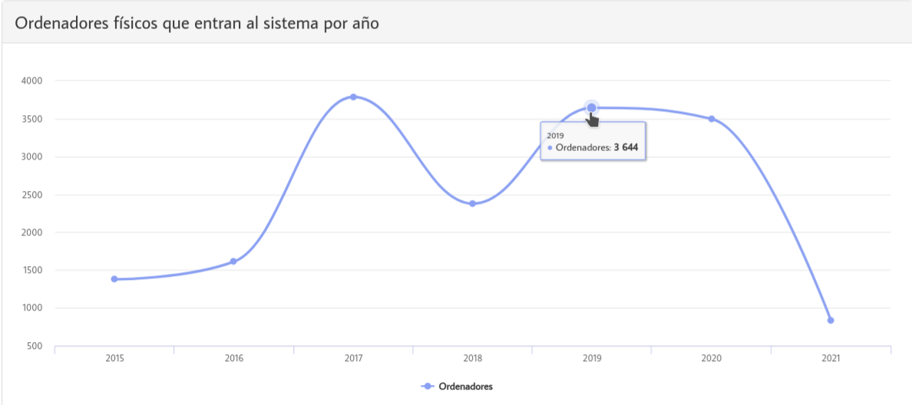
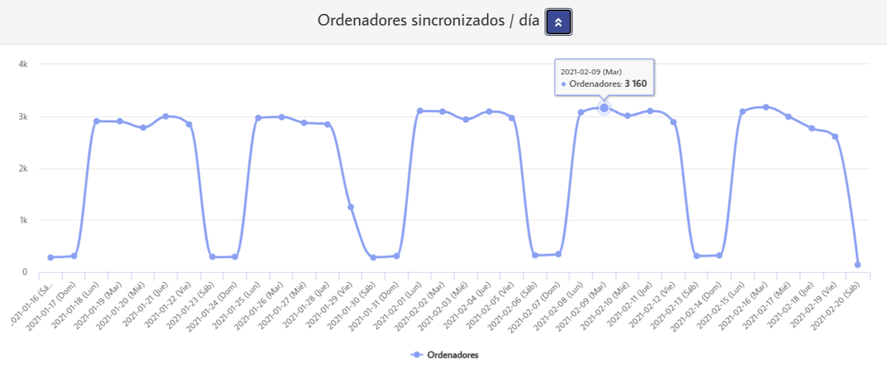
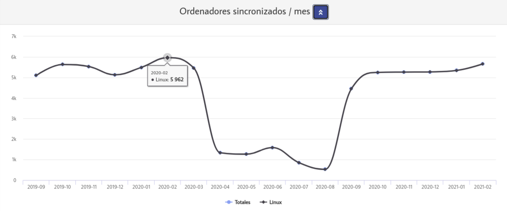

# Introducción

En el año 2014 la **Diputación General de Aragón *(DGA)*** inicia en modo pilotaje el **programa de Software Libre** con la finalidad de alcanzar los siguientes objetivos:

<ol>
<li class='fragment'>
<em>Poder <a>Reutilizar</a> equipos antiguos o de bajas prestaciones</em></li>
<li class='fragment'><em><a>Alternativa</a> a Windows 7/8 </em>(MS deja de dar soporte a WXP y a Windows 7)</li>
<li class='fragment'><em>Evitar el <a>"pirateo"</a> de Software privativo</em></li>
<li class='fragment'><em>Reducir los costes de <a>licencias de Software</a> </em></li>
<li class='fragment'><em>Fomentar el uso del <a>Software Libre en Educaci&oacute;n</a></em></li>
<li class='fragment'><em>Poder <a>Inventariar</a> todo el Software y Hardware</em></li>
<li class='fragment'><em>Facilitar labores de <a>Gesti&oacute;n de Software</a> gracias a <a>Migasfree</a></em></li>
</ol>

Como resultado de esa iniciativa surge el sistema operativo {{book.vitalinux}}, basado por completo en <b>código abierto</b>, con el cual podremos familiarizarnos a través del siguiente curso (<a href="https://catedu.github.io/curso-vitalinux/">URL del eBook</a>)

Actualmente {{book.vitalinux}} se encuentra en su versión 2.0 con **5779** instalaciones realizadas, y con **11898** instalaciones de su versión anterior 1.0 (***dato extraidos de migasfree.educa.aragon.es el 22 de febrero del 2021***), y oficialmente es usado en más de 100 centros públicos de la Comunidad Autónoma de Aragón (***centros de Educación Infantil y Primaria, centros de Enseñanza Secundaria Obligatoria, Colegios Rurales Agrupados y Centros Públicos de Educación de Personas Adultas***): <a href="https://wiki.vitalinux.educa.aragon.es/index.php?title=P%C3%A1gina_principal/Centros_participantes">Mapa Oficial Centros Vitalinux</a>

Antes de empezar el curso, y a modo de curiosidad mostraremos unas gráficas que nos informan del estado y uso de {{book.vitalinux}} y el Software Libre en nuestra Comunidad Autónoma.  Comenzaremos mostrando una gráfica que nos muestra cuantos equipos pasan a Vitalinux cada año.  Como puede observarse, el mejor año hasta ahora fue el 2017 donde entraron a formar parte de la comunidad Vitalinux **3786 nuevos ordenadores**, sin desdeñar otros años como el 2019 donde lo hicieron **3644 nuevos ordenadores**.  Señalar que en este año 2021, con tan sólo 2 meses de recorrido ya han migrado a Vitalinux **920 nuevos ordenadores** por lo que auguramos que será un buen año.

Otras gráficas interesantes pueden ser las que nos informe del número de equipos Vitalinux que se arrancan diariamente y por mes.  Eso nos dará una idea del uso que se hace de Vitalinux en los centros educativos. Como podrá observarse los equipos Vitalinux en los centros no se arrancan todos los días (***salas de informática, equipos miniportátiles, equipos de aula, etc.***), además de poderse apreciar perfectamente la disminución increible que hubo desde abril del 2020 por la pandemia del coronavirus.


Es muy importante señalar/recalcar que el éxito del <b>Programa de Software Libre Vitalinux</b> es <b>Migasfree</b>, ya que sin este servicio de <b><em>gestión masiva de equipos de manera remota y desatendida</em>, Vitalinux</b> no sería más que otro sistema operativo más. Más adelante veremos someramente todas las bondades de <b>Migasfree</b>.


